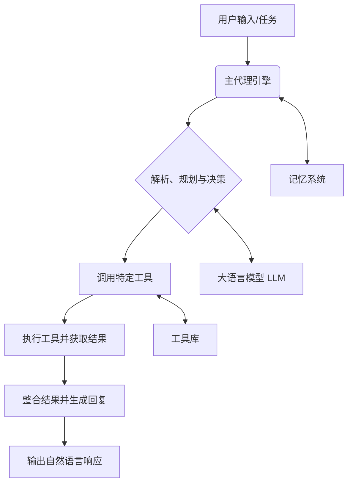

# MARS AI Agent - 学习与构建智能代理的实践框架

[](https://opensource.org/licenses/MIT)

> 一个模块化、可扩展的 Python AI 代理系统，专为希望深入理解和实践智能代理（Agent）技术的开发者设计。从零开始，快速构建属于你自己的自动化助手。

## ✨ 核心亮点

- **🧩 模块化设计**：清晰的代理、工具、记忆分离架构，让你轻松替换或扩展任意组件。
- **🚀 开箱即用**：提供单次任务、交互对话、会话管理等多种模式，满足不同场景需求。
- **📚 最佳实践**：项目本身是学习范例，代码注释详尽，遵循清晰的工程化设计原则。
- **🔧 丰富工具集**：内置文件操作、代码分析等常用工具，并支持快速集成新工具。

## 🎯 项目愿景

你是否对AI Agent的工作原理感到好奇？是否想亲手搭建一个能理解指令、使用工具、拥有记忆的智能体？

**MARS AI Agent** 正是为此而生。它不仅仅是一个工具，更是一个**可运行的学习项目**。我们旨在通过一个结构清晰、功能完整的实现，帮助你跨越理论与实践的鸿沟，深入掌握智能代理系统的核心概念与构建技巧。

## 🏗️ 项目结构

以下是项目的核心目录与文件概览，反映了清晰的模块划分：

```
.
├── main.py              # 主程序入口，命令行界面
├── README.md            # 项目说明文档
├── requirements.txt     # Python依赖包列表
├── .env                # 环境变量配置文件（模板）
├── .gitignore
│
├── -p/                  # 项目核心模块目录
├── .venv/              # Python虚拟环境（通常忽略）
└── ...                 # 其他运行时生成的目录（如__pycache__）
```
*注：这是一个典型的Python项目结构。`-p` 目录包含了代理、工具、配置等核心模块。` .venv` 是隔离的Python环境，建议在开发时使用。*

## 🚀 快速开始（1分钟体验）

想在最短时间内感受AI Agent的魅力吗？跟随以下三步：

1.  **克隆与准备**
    ```bash
    # 克隆项目（请将 <your-repo-url> 替换为实际地址）
    git clone <your-repo-url>
    cd AIagent
    # 安装依赖
    pip install -r requirements.txt
    ```
2.  **运行你的第一个代理任务**
    ```bash
    python main.py "请列出当前目录下的所有Python文件"
    ```
    *预期输出：代理将分析你的指令，调用文件系统工具，并返回找到的 `.py` 文件列表。*
3.  **进入交互模式**
    ```bash
    python main.py --interactive
    ```
    现在，你可以像和朋友对话一样，连续向代理提出任务，例如：
    `帮我创建一个名为 ‘hello.py’ 的文件，内容为打印欢迎信息`

## 📦 完整安装与配置

### 环境要求
- Python 3.8+
- 一个可用的 OpenAI API 密钥（或其他支持的LLM）

### 详细步骤
1.  **安装依赖**：`pip install -r requirements.txt`
2.  **配置API密钥**：复制根目录下的 `.env` 文件模板（或创建它），并填入你的 `OPENAI_API_KEY`。
3.  **验证安装**：运行 `python main.py --help`，查看所有可用命令和选项。

## 🧭 使用指南

### 1. 单次任务模式
执行一个独立任务后退出，适合自动化脚本和一次性查询。
```bash
python main.py "分析 requirements.txt 并总结主要依赖"
```

### 2. 交互式对话模式
进入多轮对话环境，代理会记住之前的对话上下文，实现连贯的协作。
```bash
python main.py -i
# 或
python main.py --interactive
```
在交互模式下，你还可以使用以下内置命令来管理会话：
- `help`: 查看可用的交互命令
- `clear`: 清空当前会话的短期记忆（上下文）
- `history`: 查看本次对话的历史记录
- `exit` / `quit`: 退出交互模式

### 3. 会话持久化
保存和加载完整的对话历史，打造你的专属、有记忆的助手。
```bash
# 使用一个指定的会话名称启动，历史将自动保存
python main.py --session my_project_assistant

# 清除某个会话的历史记录
python main.py --clear-session my_project_assistant
```

### 4. 探索与调试
```bash
# 查看所有已注册、可供代理调用的工具
python main.py --list-tools

# 启用详细日志，深入了解代理的思考链（Chain-of-Thought）和工具调用过程
python main.py --verbose "你的复杂任务描述"
```

## 🛠️ 系统架构概述



- **主代理引擎**：系统的协调中心，管理整个任务执行流程。
- **记忆系统**：负责存储和检索对话历史与知识，实现上下文感知和持续性。
- **工具库**：代理的“技能包”，每个工具都是一个可独立执行特定功能（如文件操作、网络请求）的模块。
- **大语言模型（LLM）**：提供核心的自然语言理解、推理和生成能力。

## 🔌 扩展指南：添加一个新工具

想要让你的代理学会一项新技能？只需简单三步：

1.  在 `tools/` 目录下创建新的Python文件，例如 `custom_tool.py`。
2.  实现一个功能函数，并使用项目约定的装饰器注册它：
    ```python
    # 示例：假设项目使用 @tool 装饰器
    from .base import tool

    @tool(name="获取天气", description="根据给定的城市名称查询当前天气情况")
    def get_weather(city: str) -> str:
        # 在这里实现你的业务逻辑，例如调用天气API
        # ...
        return f"{city}的天气是晴，25℃。"
    ```
3.  重启代理，新工具 `获取天气` 将自动出现在可用工具列表中，并可以被代理理解和调用。

## ❓ 常见问题（FAQ）

**Q: 运行时报错 `ModuleNotFoundError: No module named 'xxx'`**  
A: 请确保已安装所有依赖：`pip install -r requirements.txt`。如果问题依旧，请检查Python版本（要求3.8+）和虚拟环境是否激活。

**Q: 代理似乎没有正确理解我的指令或调用了错误的工具**  
A: 首先，尝试使用 `--verbose` 模式运行，查看代理的详细思考过程，这有助于诊断问题。其次，检查工具的描述是否清晰准确，这直接影响LLM对工具的选择。

**Q: 如何更换为其他LLM提供商或本地模型？**  
A: 本项目设计为可扩展。通常需要修改 `config/` 目录下的模型配置参数，并可能需要适配 `llm/` 模块中的客户端代码。请参考相关模块的代码和注释。

**Q: `.env` 文件应该怎么设置？**  
A: 在项目根目录下创建或编辑 `.env` 文件，内容至少应包含一行：`OPENAI_API_KEY=sk-your-actual-api-key-here`。请确保该文件已被 `.gitignore` 保护，不要提交到版本库。

## 🤝 贡献

我们非常欢迎并感谢任何形式的贡献！无论是报告Bug、提出新功能建议、改进文档，还是直接贡献代码。

1.  Fork 本仓库
2.  创建功能分支 (`git checkout -b feature/AmazingFeature`)
3.  提交你的更改 (`git commit -m 'Add some AmazingFeature'`)
4.  推送到分支 (`git push origin feature/AmazingFeature`)
5.  开启一个 Pull Request

## 📄 许可证

本项目基于 **MIT 许可证** 开源。这意味着你可以自由地使用、复制、修改、合并、发布、分发和再授权本软件的副本。

详见项目根目录下的 [LICENSE](LICENSE) 文件（如果存在）。

---

**让学习发生，让创造开始。**  
希望 **MARS AI Agent** 能成为你探索人工智能世界的得力伙伴与起点！
