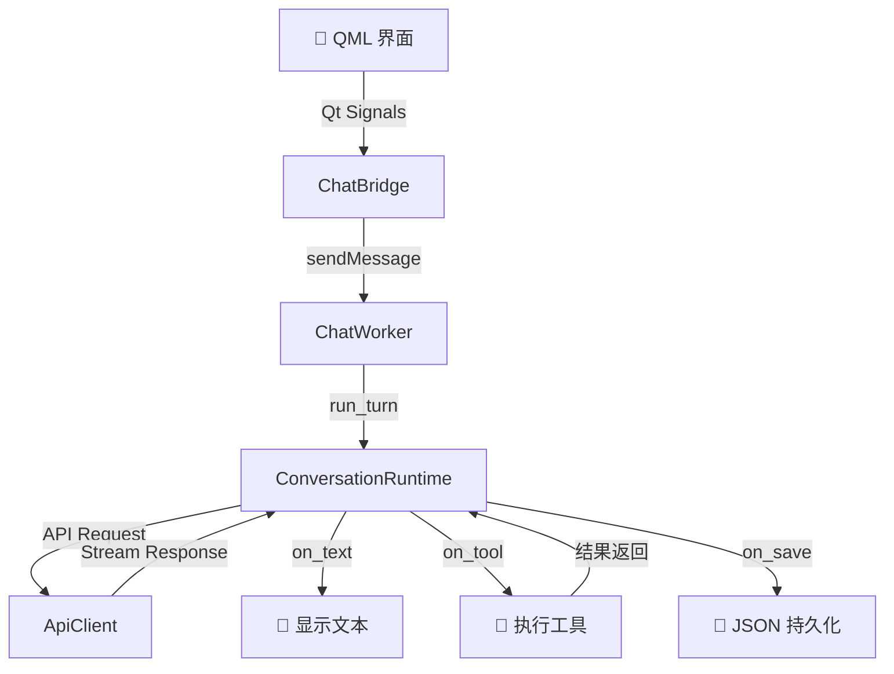

# 🚀 MARS AI Agent

<p align="center">
  
  
  
  
  
</p>

> 🧠 基于 **ConversationRuntime** 架构的 AI 代理系统，支持命令行和 PySide6 QML 桌面客户端。  
> LLM 自主规划、调用工具、验证结果，完成文件操作、代码分析、网络搜索等任务。

---

## ✨ 功能特性

| 特性 | 说明 |
|------|------|
| 🖥️ **双端运行** | CLI 交互模式 + PySide6 QML 桌面 GUI |
| 🔄 **ConversationRuntime** | 单次 `run_turn()` 完成完整对话轮次，回调驱动 |
| 🛠️ **17 个工具** | 文件读写、Shell、网络搜索、网页抓取、正则 grep、Python 执行、文件管理等 |
| 💾 **会话持久化** | JSON 自动保存，支持加载/删除/新建/列表 |
| 🔗 **LLM 上下文继承** | 加载会话自动重建完整对话历史传入 LLM |
| 📝 **AI 回复持久化** | talk/finish 文本自动写入 Memory → JSON |
| 🃏 **工具卡片 UI** | 可折叠的半透明工具调用面板 |
| 🔄 **模型热切换** | `ApiClient.active_model` 类变量，运行时即时切换 |
| 🔒 **权限控制** | 4 级权限模式（READ_ONLY / WORKSPACE_WRITE / DANGER_FULL / ALL） |
| 🔍 **收敛检测** | 连续 3 步相同工具+参数 → 自动 finish |
| 📦 **会话压缩** | 超过 50000 token 自动摘要压缩 |
| 🌗 **亮暗主题** | 按 `T` 切换，FluentTheme 配色 |
| 🩹 **截断 JSON 修复** | LLM 响应超出 token 限制时自动提取文本 |

---

## 🧰 技术栈

<div align="center">

| 技术 | 用途 |
|------|------|
|  | 编程语言 |
|  | 桌面 GUI 框架 |
|  | 云端 LLM |
|  | 本地 LLM |
|  | 存储格式 |
|  | API 协议 |

</div>

### 📦 核心依赖

- `openai` — LLM API 调用
- `ollama` — 本地模型支持
- `requests` + `beautifulsoup4` — 网络请求与网页解析
- `chardet` — 文件编码自动检测
- `pyttsx3` — 文字转语音

---

## 🚀 快速开始

### 1️⃣ 安装依赖

```bash
pip install -r requirements.txt
```

### 2️⃣ 配置 API Key

> ⚠️ **注意**：使用云端模型（DeepSeek）时需要设置环境变量：
> ```bash
> set DEEPSEEK_API_KEY=your_api_key_here
> ```

### 3️⃣ 运行

**🖥️ 命令行模式：**

```bash
python main.py
```

**🖼️ 桌面客户端：**

```bash
python QT/main.py
```

> 💡 **小提示**：在桌面客户端中按 `T` 键可以切换亮/暗主题哦！

---

## 📁 项目结构

```
📦 MARS AI Agent
├── 📄 main.py                          # CLI 入口
├── 📄 ARCHITECTURE.md                  # 架构文档
├── 📄 QT_TUTORIAL.md                   # QML 教程
├── 📄 README.md                        # 本文件
├── 📄 requirements.txt                 # 依赖清单
│
├── 📂 QT                               # 🖥️ 桌面客户端
│   ├── 📄 main.py                      # 桌面入口（QML 引擎）
│   ├── 📂 backend/                     # 后端逻辑
│   │   ├── 📄 chat_bridge.py           # Python↔QML 桥接
│   │   └── 📄 worker.py                # ChatWorker (QThread)
│   └── 📂 frontend/MARS/               # 🎨 QML 前端
│       ├── 📄 main.qml                 # 主窗口
│       ├── 📄 FluentTheme.qml          # 亮暗主题
│       ├── 📄 qmldir                   # 模块声明
│       ├── 📂 components/              # UI 组件
│       │   ├── MessageBubble.qml
│       │   ├── InputBar.qml
│       │   └── NavigationPanel.qml
│       └── 📂 pages/                   # 页面
│           ├── ChatPage.qml
│           ├── ToolsPage.qml
│           └── SettingsPage.qml
│
├── 📂 core                             # ⚙️ 核心逻辑
│   ├── 📂 runtime/                     # 运行时核心
│   │   ├── 📄 types.py                 # 数据结构定义
│   │   ├── 📄 conversation.py          # ConversationRuntime
│   │   ├── 📄 permissions.py           # 权限策略
│   │   ├── 📄 usage.py                 # Token 统计
│   │   └── 📄 compact.py               # 会话压缩
│   ├── 📂 llm/                         # 🤖 LLM 交互
│   │   └── 📄 client.py                # ApiClient + ModelManager
│   ├── 📂 agent/                       # 🧠 代理逻辑
│   │   └── 📄 memory.py                # Memory（JSON 持久化）
│   ├── 📂 prompt/                      # 📝 提示词
│   │   ├── 📄 builder.py               # SystemPromptBuilder
│   │   └── 📄 __init__.py
│   ├── 📂 tools/                       # 🔧 工具系统
│   │   ├── 📄 __init__.py              # 工具注册表
│   │   └── 📄 tools.py                 # 17 个工具实现
│   └── 📂 config/                      # ⚙️ 配置
│       └── 📄 settings.py              # 配置项
│
└── 📂 session/                         # 💾 会话 JSON 文件
```

---

## 🏗️ 架构设计

### 整体流程



### 详细架构

```
┌──────────────────────────────────────────────────────────────┐
│ 🎨 QML 界面                                                  │
│  ┌──────────┐  ┌───────────┐  ┌──────────────┐              │
│  │ ChatPage │  │ ToolsPage │  │ SettingsPage │              │
│  └────┬─────┘  └───────────┘  └──────────────┘              │
│       │                                                      │
│       │ Qt Signals (messageReceived, toolCalled, ...)        │
│       ▼                                                      │
│  ┌──────────────────────────────────────────────────┐        │
│  │        ChatBridge (QObject)                       │        │
│  │  📤 sendMessage()  📥 textChunk signal           │        │
│  │  🛠️ toolInvoked()  💾 messageReceived signal    │        │
│  └──────────┬───────────────────────────────────────┘        │
└─────────────┼────────────────────────────────────────────────┘
              │
              │ ChatWorker(text, api_client, memory)
              ▼
┌──────────────────────────────────────────────────────────────┐
│ 🔄 ChatWorker (QThread)                                      │
│  ┌──────────────────────────────────────────────────────┐    │
│  │  ConversationRuntime(messages, system_prompt)        │    │
│  │                                                      │    │
│  │  for iteration in range(max_iterations):             │    │
│  │    request = ApiRequest(messages, system, tools)     │    │
│  │    blocks, usage = api_client.stream(request)        │    │
│  │    msg = ConversationMessage.assistant(blocks)       │    │
│  │                                                      │    │
│  │    if not tool_uses:  ← talk/finish                  │    │
│  │      on_text(block)    → textChunk → QML 显示       │    │
│  │      on_save("assistant", block) → JSON              │    │
│  │      return                                          │    │
│  │                                                      │    │
│  │    for tool_use in tool_uses:  ← shell/read_file     │    │
│  │      result = executor.execute(name, input)          │    │
│  │      on_tool(name, input, result) → QML 工具卡片     │    │
│  │      on_save("tool", result, name, args) → JSON      │    │
│  └──────────────────────────────────────────────────────┘    │
└──────────────────────────────────────────────────────────────┘
```

### 🤖 LLM 上下文继承

```
加载会话时
  └─ memory_to_runtime_messages(memory.history)
      将 JSON 条目转为 ConversationMessage 序列
      预填入 runtime.messages

run_turn() 调用
  └─ ApiRequest(messages=...)
      LLM 看到完整对话历史
```

---

## 📊 数据模型

```python
# 🧩 ConversationMessage
├── role: USER
│   └── blocks: [TextBlock]
├── role: ASSISTANT
│   └── blocks: [TextBlock] 或 [ToolUse]
└── role: TOOL
    └── blocks: [ToolResult]


# 💾 Memory (JSON 存储)
├── history: list[dict]
│   ├── {"role": "user", "content": "..."}
│   ├── {"input": {"tool": "shell", "tool_args": "..."},
│   │    "output": "..."}
│   └── {"role": "assistant", "content": "..."}
└── messages: list[dict]  (仅 user + assistant，用于会话摘要生成)
```

---

## 🎮 使用指南

### ⌨️ CLI 命令

| 命令 | 功能 | 示例 |
|------|------|------|
| `help` | 显示帮助 | `help` |
| `clear` | 清空当前会话 | `clear` |
| `history` | 查看工具步骤记录 | `history` |
| `messages` | 查看对话消息 | `messages` |
| `list` | 列出所有会话 | `list` |
| `load <文件名>` | 加载指定会话 | `load session1.json` |

### 🖱️ GUI 操作

| 操作 | 说明 |
|------|------|
| ⌨️ Enter | 发送消息 |
| ⇧ Shift + Enter | 换行 |
| ☰ 按钮 | 切换侧边栏（会话列表） |
| 📋 左侧导航 | 切换页面（Chat / Tools / Settings） |
| ⌨️ `T` 键 | 切换暗色模式 |
| ⚙️ Settings 页 | 切换模型、管理自定义模型、配置 API Key |

---

## 🛠️ 工具列表（17 个）

<div align="center">

| 工具 | 功能 | 关键参数 |
|:----:|:----:|:---------:|
| 📖 `read_file` | 读取文件 | file_path, search, start_line, max_lines |
| ✏️ `write_file` | 写入文件 | file_path, content, append, backup |
| 🔄 `replace_content` | 替换内容 | file_path, old_content, new_content, regex, count |
| 🖥️ `shell` | 执行命令 | command, timeout, cwd |
| 💬 `talk` | 用户对话 | message |
| ✅ `finish` | 完成任务 | response |
| 🌐 `web_search` | 网络搜索 | query |
| 📄 `web_content` | 获取网页 | urls |
| 🌤️ `weather` | 查询天气 | city, detail |
| 🔊 `speaking` | 文字转语音 | text, rate, volume |
| 📂 `list_directory` | 列出目录 | path, all, pattern |
| 📁 `create_directory` | 创建目录 | path |
| 🗑️ `delete_path` | 删除路径 | path, recursive |
| 📋 `copy_move` | 复制/移动 | src, dst, action |
| 🔍 `grep_files` | 搜索文件 | pattern, path, include |
| ℹ️ `file_info` | 文件信息 | path |
| 🐍 `python_exec` | 执行代码 | code |

</div>

---

## 🔒 权限控制

| 模式 | 级别 | 说明 |
|:----:|:----:|:------|
| 🟢 READ_ONLY | 1 | 只读，仅允许查看文件 |
| 🟡 WORKSPACE_WRITE | 2 | 工作区写入权限 |
| 🟠 DANGER_FULL | 3 | 危险操作权限 |
| 🔴 ALL | 4 | 完全控制 |
 待续

---

## 📄 许可证

[](LICENSE)

本项目基于 **MIT** 许可证开源。
