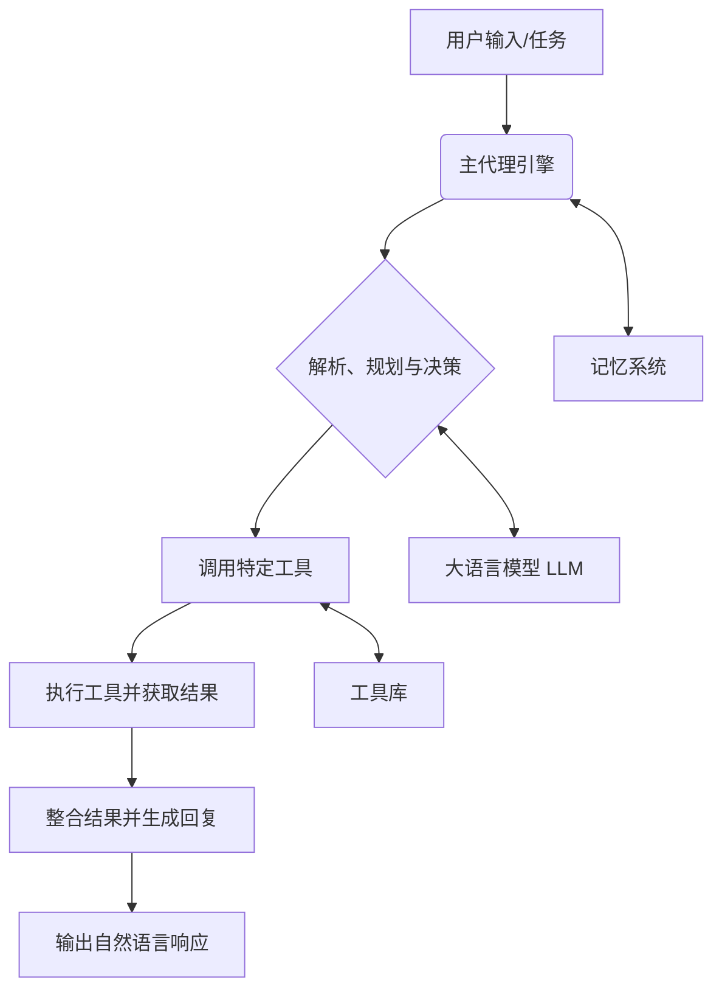

# MARS AI Agent - 学习与构建智能代理的实践框架

[](https://opensource.org/licenses/MIT)

> 一个模块化、可扩展的 Python AI 代理系统，专为希望深入理解和实践智能代理（Agent）技术的学习者设计。从零开始，快速构建属于你自己的自动化助手。

## ✨ 核心亮点

- **🧩 模块化设计**：清晰的代理、工具、记忆分离架构，让你轻松替换或扩展任意组件。
- **🚀 开箱即用（并非（）**：提供交互对话、会话管理等，满足不同场景需求。
- **🔧 丰富工具集**：内置文件操作、代码分析等常用工具，并支持快速集成新工具。

## 🎯 项目愿景

你是否对AI Agent的工作原理感到好奇？是否想亲手搭建一个能理解指令、使用工具、拥有记忆的智能体？

**MARS AI Agent** 正是为此而生。它不仅仅是一个工具，更是一个**可运行的学习项目**。通过一个结构清晰、功能完整的实现，帮助你跨越理论与实践的鸿沟，深入掌握智能代理系统的核心概念与构建技巧。

## 🏗️ 项目结构

以下是项目的核心目录与文件概览，反映了清晰的模块划分：

```
.
├── main.py              # 主程序入口，命令行界面
├── README.md            # 项目说明文档
├── requirements.txt     # Python依赖包列表
├── .env                # 环境变量配置文件（模板）
├── .gitignore
│
├── agent/              # 代理核心模块（聊天代理、记忆管理）
├── config/             # 配置文件与设置
├── llm/                # 大语言模型客户端与接口
├── prompt/             # 提示词模板管理
├── tools/              # 工具库（文件操作、代码分析等）
├── docs/               # 文档目录
├── session/            # 会话持久化存储（自动生成）
├── logs/               # 日志文件目录（自动生成）
├── .venv/              # Python虚拟环境（通常忽略）
└── ...                 # 其他运行时生成的目录（如__pycache__）
```
*注：这是一个模块化的Python AI Agent项目结构。核心模块按功能分离，便于维护和扩展。`session/`和`logs/`目录会在运行时自动生成。`.venv`是隔离的Python环境，建议在开发时使用。*

## 🚀 快速开始（1分钟体验）

想在最短时间内感受AI Agent的魅力吗？跟随以下三步：

1.  **克隆与准备**
    ```bash
    # 克隆项目（请将 <your-repo-url> 替换为实际地址）
    git clone <your-repo-url>
    cd AIagent
    # 安装依赖
    pip install -r requirements.txt
    ```
2.  **运行交互模式**
    ```bash
    python main.py
    ```
    *程序将启动交互式命令行界面，你可以直接与AI代理对话。*
3.  **执行你的第一个代理任务**
    在交互模式中，输入你的任务指令，例如：
    ```
    请列出当前目录下的所有Python文件
    ```
    *预期输出：代理将分析你的指令，调用文件系统工具，并返回找到的 `.py` 文件列表。*

**进阶用法**：你也可以在Python代码中直接使用ChatAgent类：
```python
from agent.chat_agent import ChatAgent

# 创建代理实例并执行任务
agent = ChatAgent(user_input="请分析requirements.txt文件")
agent.run()
```

## 📦 完整安装与配置

### 环境要求
- Python 3.8+
- 一个可用的 DeepSeek API 密钥（或其他支持的LLM，如OpenAI或本地Ollama）

### 详细步骤
1.  **安装依赖**：`pip install -r requirements.txt`
2.  **配置API密钥**：复制根目录下的 `.env` 文件模板（或创建它），根据你的LLM提供商配置相应参数：
   - DeepSeek: 设置 `DEEPSEEK_API_KEY` 和 `DEEPSEEK_BASE_URL`
   - OpenAI: 设置 `OPENAI_API_KEY`（需要相应代码适配）
   - 本地Ollama: 设置 `LLM_URL`（默认为 `http://localhost:11434`）
3.  **验证安装**：运行 `python main.py`，如果成功进入交互模式，说明安装配置正确。

## 🧭 使用指南

### 1. 交互式对话模式（默认）
运行 `python main.py` 直接进入交互式命令行界面，代理会记住对话上下文，实现连贯的协作。

在交互模式下，你可以使用以下内置命令管理会话：
- `help`: 查看所有可用命令
- `clear`: 清空当前会话历史
- `history`: 查看步骤执行历史记录
- `messages`: 查看对话消息记录
- `summary`: 显示当前会话的摘要
- `list`: 列出所有保存的会话
- `load <文件名>`: 加载指定会话文件
- `exit` / `quit`: 退出交互模式

### 2. 会话持久化
对话历史自动保存到 `session/` 目录中，实现有记忆的助手体验。

- **自动保存**: 每次对话结束时，会话会自动保存
- **加载历史**: 使用 `load <文件名>` 命令加载之前的会话
- **查看会话列表**: 使用 `list` 命令查看所有保存的会话

### 3. 编程式使用
在Python代码中直接使用ChatAgent类执行单次任务：
```python
from agent.chat_agent import ChatAgent

# 创建代理实例并执行任务
agent = ChatAgent(user_input="请分析requirements.txt文件")
agent.run()

# 启用调试输出
agent = ChatAgent(user_input="你的任务", debug=True)
agent.run()
```

### 4. 探索与调试
- **查看可用工具**: 在交互模式下，代理会自动选择合适工具，你也可以查看 `tools/tools.py` 了解所有可用工具
- **调试模式**: 创建ChatAgent实例时设置 `debug=True` 可查看详细执行过程
- **日志文件**: 运行日志保存在 `logs/` 目录中

## 🛠️ 系统架构概述



- **主代理引擎**：系统的协调中心，管理整个任务执行流程。
- **记忆系统**：负责存储和检索对话历史与知识，实现上下文感知和持续性。
- **工具库**：代理的“技能包”，每个工具都是一个可独立执行特定功能（如文件操作、网络请求）的模块。
- **大语言模型（LLM）**：提供核心的自然语言理解、推理和生成能力。

## 🔌 扩展指南：添加一个新工具

想要让你的代理学会一项新技能？只需简单三步：

1.  **创建工具函数**
    在 `tools/tools.py` 文件中添加新的工具函数，例如：
    ```python
    def get_weather_tool(**kwargs):
        """
        获取城市天气信息
        :param city: 城市名称
        :return: 天气信息字符串
        """
        city = kwargs.get("city")
        if not city:
            return "Error: Missing city parameter"
        
        # 在这里实现天气API调用
        # ...
        return f"{city}的天气是晴，25℃。"
    ```

2.  **注册工具到注册表**
    在 `tools/__init__.py` 文件的 `TOOL_REGISTRY` 字典中添加新工具：
    ```python
    "get_weather": (
        get_weather_tool,
        "获取城市天气信息。参数: city - 城市名称",
        {
            "required_params": ["city"],
            "optional_params": []
        }
    )
    ```

3.  **重启代理**
    新工具 `get_weather` 将自动出现在可用工具列表中，代理可以理解并调用它。

**注意事项**：
- 工具函数应使用 `**kwargs` 接收参数
- 提供清晰的函数文档字符串，描述参数和返回值
- 在 `TOOL_REGISTRY` 中提供准确的描述和参数模式

## ❓ 常见问题（FAQ）

**Q: 运行时报错 `ModuleNotFoundError: No module named 'xxx'`**  
A: 请确保已安装所有依赖：`pip install -r requirements.txt`。如果问题依旧，请检查Python版本（要求3.8+）和虚拟环境是否激活。

**Q: 代理似乎没有正确理解我的指令或调用了错误的工具**  
A: 在config文件夹setting中令 `debugmode=True` 可查看详细执行过程，帮助诊断问题。同时检查工具的描述是否清晰准确，这直接影响LLM对工具的选择。

**Q: 如何更换为其他LLM提供商或本地模型？**  
A: 本项目支持DeepSeek、OpenAI和本地Ollama模型。修改 `.env` 文件中的 `DEEPSEEK_API_KEY`、`DEEPSEEK_BASE_URL` 或 `LLM_URL` 配置。详细配置请参考 `config/settings.py` 和 `llm/client.py` 中的代码,在client.py中添加新的模型,在settings.py中写入新的模型对应的名字

**Q: `.env` 文件应该怎么设置？**  
A: 在项目根目录下创建或编辑 `.env` 文件，根据需要配置以下参数：
```
DEEPSEEK_API_KEY=your-deepseek-api-key
DEEPSEEK_BASE_URL=https://api.deepseek.ai
LLM_URL=http://localhost:11434  # 本地Ollama服务地址
```
请确保该文件已被 `.gitignore` 保护，不要提交到版本库。

## 🤝 贡献

我们非常欢迎并感谢任何形式的贡献！无论是报告Bug、提出新功能建议、改进文档，还是直接贡献代码。

1.  Fork 本仓库
2.  创建功能分支 (`git checkout -b feature/AmazingFeature`)
3.  提交你的更改 (`git commit -m 'Add some AmazingFeature'`)
4.  推送到分支 (`git push origin feature/AmazingFeature`)
5.  开启一个 Pull Request

## 📄 许可证

本项目基于 **MIT 许可证** 开源。这意味着你可以自由地使用、复制、修改、合并、发布、分发和再授权本软件的副本。

详见项目根目录下的 [LICENSE](LICENSE) 文件（如果存在）。

---

**让学习发生，让创造开始。**  
希望 **MARS AI Agent** 能成为你探索人工智能世界的得力伙伴与起点！
